# 🌟 Soroban Token BDB

This project is a Rust-based Soroban smart contract deployed on the Stellar Testnet, implementing a CAP-46 compliant token. Explore its live activity on [Stellar Expert](https://stellar.expert/explorer/testnet/contract/CDOQZOTYUEYVJXCW6DNY3EVM6DM254XFTPUSPZH2DIITCCORC7VCDW33).

It includes robust error handling, access control, gas-efficient optimizations, and a full test suite to ensure reliability and prevent costly mistakes.

# 🚀 Features

## 🎯 What the Contract Allows

* ✅ Initialization with metadata (name, symbol, decimals) and admin address
* ✅ Minting tokens to any account (admin-only)
* ✅ Burning tokens from user balances
* ✅ Reading balances of any account
* ✅ Querying total supply of tokens in circulation
* ✅ Transferring tokens between accounts
* ✅ Approving other accounts to spend tokens on your behalf
* ✅ Delegated transfers using transfer_from
* ✅ Querying allowances between accounts
* ✅ Admin-controlled settings for secure governance

## 🛠️ Technical Highlights

* 🧱 CAP-46 compliant interface for full compatibility with Soroban wallets and DEXs
* 🔐 Access control enforced via require_auth() for admin and user actions
* 🛡️ Custom error handling with TokenError enum for precise debugging
* 🧪 25+ unit tests covering all critical paths and edge cases
* ⚙️ Optimized WASM build for reduced size and lower storage costs
* 📦 Structured storage using DataKey enum for instance and persistent data separation
* 📊 Rich event logging for all state-changing operations (mint, burn, transfer, approve)
* 🔍 Safe defaults for uninitialized reads (e.g., balance = 0, empty metadata)
* 🧼 Gas-efficient design, including key cleanup when balances or allowances reach zero

## 🗂️ Project Structure

This repository uses the recommended structure for a Soroban project:

```
.
├── src
│   ├── lib.rs         # TokenTrait implementation (CAP-46)
│   ├── storage.rs     # DataKey enum for instance/persistent storage
│   ├── errors.rs      # TokenError enum with all failure cases
│   └── test.rs        # Full test suite for all contract methods
├── Cargo.toml
└── README.md
```

Includes the following WASM optimization:

```
[profile.release]
opt-level = "z"
overflow-checks = true
codegen-units = 1
lto = true
```
## 📝 Prerequisites

- Install WSL for Windows (easier for deploying in Testnet)
- Install Rust Toolchain 
```
# Install Rust
curl https://sh.rustup.rs -sSf | sh
rustc --version >= 1.70
cargo --version >= 1.70
# Add Soroban-compatible target
rustup target add wasm32v1-none
# Confirm target availability
rustup target list | grep wasm32
```
- Install Stellar CLI
```
cargo install --locked stellar-cli
stellar --version >= 20.0.0
```
- Install others
```
# Install jq for JSON parsing (used in event queries)
sudo apt install jq
# Optional: Install tarpaulin for test coverage
cargo install cargo-tarpaulin
```
- Install node and npm for future front integration
```
# Install NVM (Node Version Manager)
curl -o- https://raw.githubusercontent.com/nvm-sh/nvm/v0.39.7/install.sh | bash
export NVM_DIR="$HOME/.nvm"
source "$NVM_DIR/nvm.sh"
# Install latest LTS version of Node
nvm install --lts
# Confirm versions
node --version
npm --version
```
- Create a Stellar Account
```
# Generate a keypair
stellar keys generate <name> --network testnet
# View public key
stellar keys address <name>
# View private key (do NOT share)
stellar keys show <name>
# Fund account using Friendbot
curl "https://friendbot.stellar.org?addr=$PUBLIC_KEY"
```

## 🔧 Project Initialization

This step was already done to create a new project from scratch
`stellar contract init token_bdb`

## 💻 Execution Procedure

### Compilation Process

```
cargo clean
stellar contract build
# This generates target/wasm32v1-none/release/token_bdb.wasm
# Optimize WASM
stellar contract optimize --wasm target/wasm32-unknown-unknown/release/token_bdb.wasm
# Validate WASM
ls -lh target/wasm32v1-none/release/token_bdb.wasm
rustup target add wasm32v1-none
rustup target list | grep wasm32
```
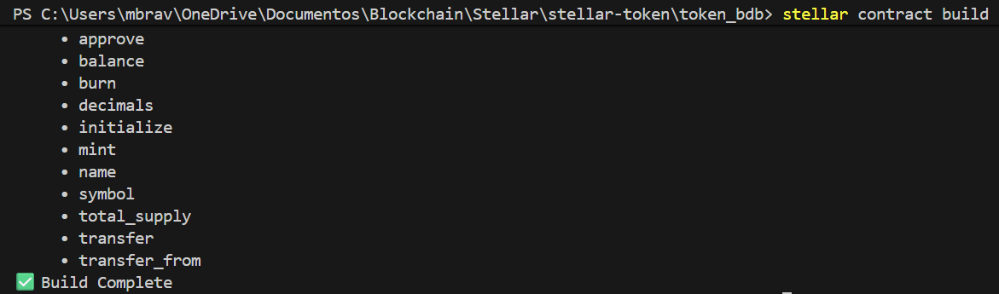

### Deploy Process
```
stellar contract deploy --wasm target/wasm32v1-none/release/token_bdb.wasm --source <name> --network testnet
# Save CONTRACT_ID
mkdir -p .soroban
echo CONTRACT_ID > .soroban/token_id
# Export as ENV VAR
export TOKEN_CONTRACT_ID=$CONTRACT_ID
```
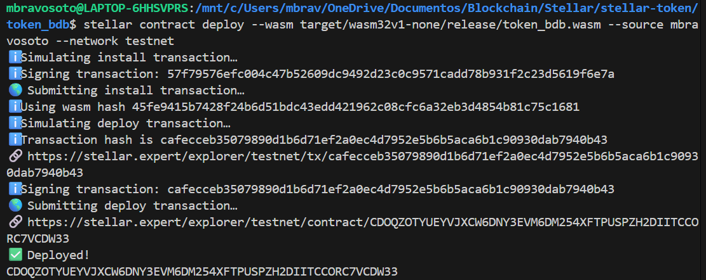

### Invoke Contract Process

- Invoke Initialize
`stellar contract invoke --id $TOKEN_CONTRACT_ID --source <name> --network testnet -- initialize --admin PUBLIC_KEY --name "Buen Dia Token" --symbol "BDB" --decimals 7`
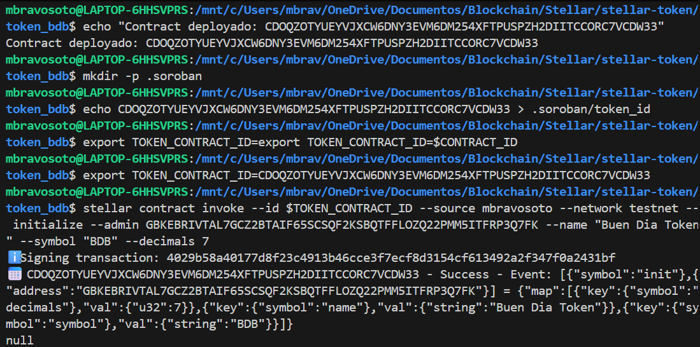
- Validate Contract Parameters
```
nombre=$(stellar contract invoke --id $TOKEN_CONTRACT_ID --source-account <name> --network testnet -- name)
symbol=$(stellar contract invoke --id $TOKEN_CONTRACT_ID --source-account <name> --network testnet -- symbol)
decimals=$(stellar contract invoke --id $TOKEN_CONTRACT_ID --source-account <name> --network testnet -- decimals)
total_supply=$(stellar contract invoke --id $TOKEN_CONTRACT_ID --source-account <name> --network testnet -- total_supply)
echo "Nombre:" $nombre - "Simbolo:" $symbol - "Decimales:" $decimals - "Total supply:" $total_supply
```
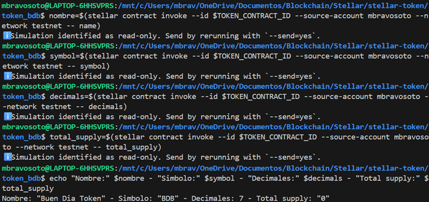
- Mint
`stellar contract invoke --id $TOKEN_CONTRACT_ID --source <name> --network testnet -- mint --to PUBLIC_KEY --amount 10000000000000`
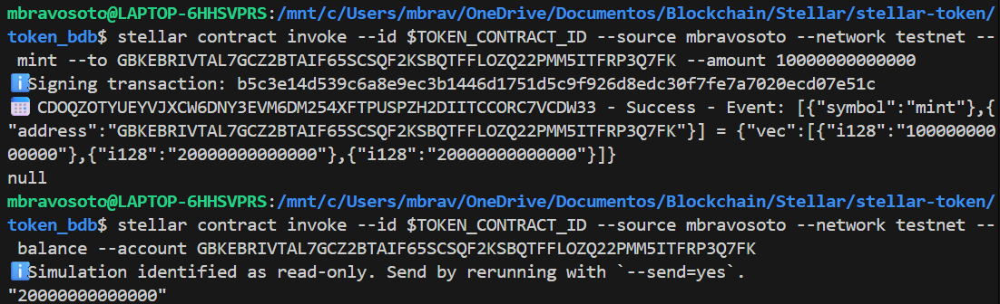
- Balance
`stellar contract invoke --id $TOKEN_CONTRACT_ID --source <name> --network testnet -- balance --account PUBLIC_KEY`
- Create other account for testing and fund it with friendbot
- Transfer
```
stellar contract invoke --id $TOKEN_CONTRACT_ID --source <name> --network testnet -- transfer --from $PUBLIC_KEY_NAME --to $PUBLIC_KEY_NAME2  --amount 1000000000
# Validate balance
balance_name=$(stellar contract invoke --id $TOKEN_CONTRACT_ID --source <name> --network testnet -- balance --account PUBLIC_KEY)
balance_name2=$(stellar contract invoke --id $TOKEN_CONTRACT_ID --source <name2> --network testnet -- balance --account PUBLIC_KEY)
echo "Balance <name>:" $balance_name - "Balance <name2>:" $balance_name2
```
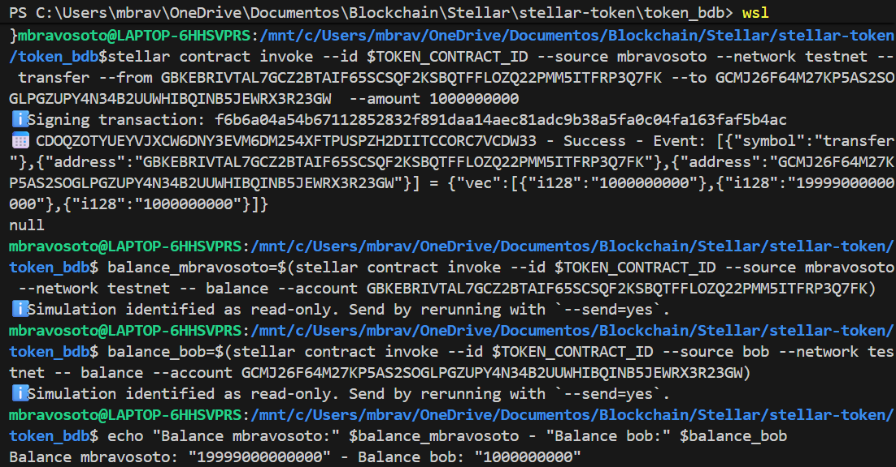
- Approve
`stellar contract invoke --id $TOKEN_CONTRACT_ID --source <name> --network testnet -- approve --from PUBLIC_KEY_NAME --spender PUBLIC_KEY_NAME2 --amount 500000000`
- Allowance
`stellar contract invoke --id $TOKEN_CONTRACT_ID --source <name> --network testnet -- allowance --from PUBLIC_KEY_NAME --spender PUBLIC_KEY_NAME2`
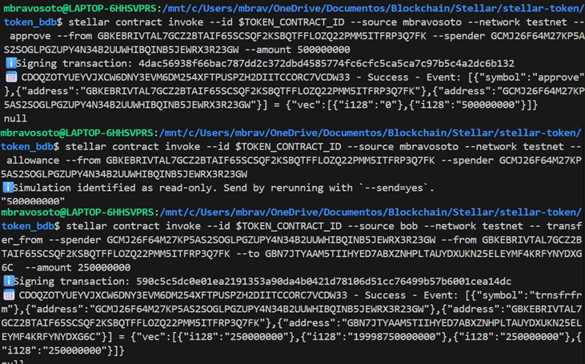
- Create third account for testing and fund it with friendbot: name2 will transfer from name to name3
- Transfer From
`stellar contract invoke --id $TOKEN_CONTRACT_ID --source <name2> --network testnet -- transfer_from --spender PUBLIC_KEY_NAME2 --from PUBLIC_KEY_NAME --to PUBLIC_KEY_NAME3  --amount 250000000`
- Burn tokens
`stellar contract invoke --id $TOKEN_CONTRACT_ID --source <name2> --network testnet -- burn --from PUBLIC_KEY_NAME2 --amount 100000000`

- Total Supply
`stellar contract invoke --id $TOKEN_CONTRACT_ID --source <name2> --network testnet -- total_supply`
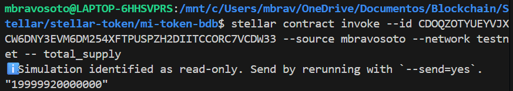
- Validate in Stellar Expert all events
```
echo "https://stellar.expert/explorer/testnet/contract/$TOKEN_CONTRACT_ID"
stellar events --id $TOKEN_CONTRACT_ID --network testnet --start-ledger 1000000 --output json | jq '.'
```
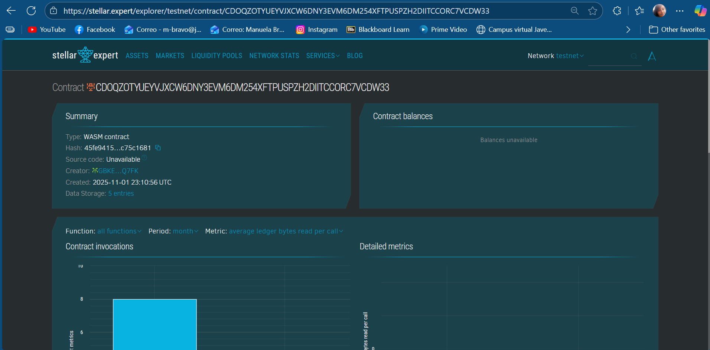

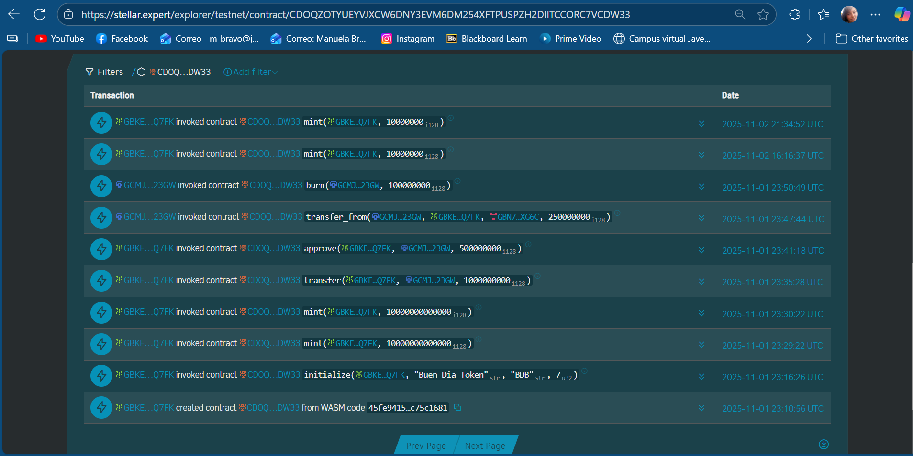

## 🧠 Contract Overview

The following functions are implemented in this CAP-46 compliant token contract:

### Initialization

`initialize(env, admin, name, symbol, decimals) -> Result<(), TokenError>`
- Sets the admin address
- Stores token metadata (name, symbol, decimals)
- Initializes total supply to 0
- Prevents re-initialization
- Emits a metadata event
- Extends TTL for instance storage

### Core Token Functions

`mint(env, to, amount) -> Result<(), TokenError>`
- Admin-only: creates new tokens
- Increases recipient balance and total supply
- Emits a mint event

`burn(env, from, amount) -> Result<(), TokenError>`
- Requires user authorization
- Decreases user balance and total supply
- Emits a burn event

`transfer(env, from, to, amount) -> Result<(), TokenError>`
- Requires sender authorization
- Transfers tokens between accounts
- Disallows self-transfer
- Emits a transfer event

`approve(env, from, spender, amount) -> Result<(), TokenError>`
- Sets or revokes allowance
- Emits an approval event

`transfer_from(env, spender, from, to, amount) -> Result<(), TokenError>`
- Requires spender authorization
- Moves tokens from from to to using allowance
- Updates balances and remaining allowance
- Emits a delegated transfer event

### Query Functions

- `balance(env, account) -> i128`: Returns the token balance of an account
- `allowance(env, from, spender) -> i128`: Returns the remaining allowance
- `total_supply(env) -> i128`: Returns the total number of tokens in circulation
- `name(env) -> String`: Returns the token name
- `symbol(env) -> String`: Returns the token symbol
- `decimals(env) -> u32`: Returns the token decimal precision
- `admin(env) -> Address`: Returns the admin address

### Error Codes

The contract uses a custom TokenError enum with explicit error codes for clarity and debugging:
- **1**: AlreadyInitialized – Contract has already been initialized
- **2**: InvalidAmount – Amount must be greater than 0
- **3**: InsufficientBalance – Not enough tokens to complete the operation
- **4**: InsufficientAllowance – Not enough approved tokens for transfer_from
- **5**: NotInitialized – Contract must be initialized before use
- **6**: InvalidDecimals – Decimals exceed maximum allowed (18)
- **7**: OverflowError – Arithmetic overflow detected
- **8**: InvalidRecipient – Self-transfers are not allowed
- **9**: InvalidMetadata – Name or symbol is empty or too long

### Storage Strategy
- `instance()` → Global data: Admin, TokenName, TokenSymbol, Decimals, TotalSupply, Initialized
- `persistent()` → Per-account data: Balance(Address), Allowance(Address, Address)
- `TTL` is extended by `100_000` to `200_000` ledgers for both instance and persistent entries
- Keys are removed when balances or allowances reach zero to optimize storage

## 🧪 Unit Tests

The contract includes a comprehensive test suite using Soroban’s Env, Address, and mock_all_auths() utilities. Run all tests with: 

```
# Execute all tests
cargo test

# Check detailed output
cargo test -- --nocapture

# Execute specific test
cargo test test_transfer

# Run tests in release mode (faster)
cargo test --release
```
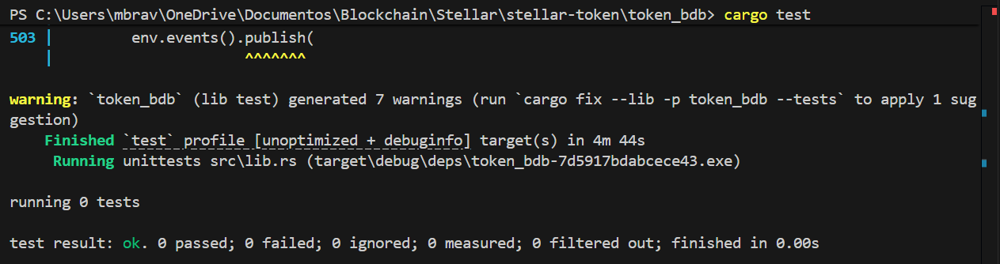

Validate test coverage:
```
# Install cargo-tarpaulin (just once)
cargo install cargo-tarpaulin

# Generate coverage report
cargo tarpaulin --out Html

# Open report in Windows
start tarpaulin-report.html
```

### Success Cases

- `test_initialize`: Initializes the contract and stores metadata
- `test_mint_and_balance`: Admin mints tokens and balance is updated
- `test_transfer`: Transfers tokens between users and updates both balances
- `test_approve_and_transfer_from`: Approves and delegates transfer with allowance tracking
- `test_burn`: Burns tokens and reduces both balance and total supply

### Failure Cases

- `test_initialize_twice_fails`: Prevents re-initialization `(Error #1: AlreadyInitialized)`
- `test_invalid_decimals`: Rejects decimals > 18 `(Error #6: InvalidDecimals)`
- `test_mint_zero_fails`: Rejects minting 0 tokens `(Error #2: InvalidAmount)`
- `test_transfer_insufficient_balance`: Prevents overspending `(Error #3: InsufficientBalance)`
- `test_transfer_to_self`: Disallows self-transfer `(Error #8: InvalidRecipient)`
- `test_transfer_from_insufficient_allowance`: Prevents delegated overspending `(Error #4: InsufficientAllowance)`
`test_operations_without_init`: Blocks all operations before initialization `(Error #5: NotInitialized)`

### Test Highlights

- Uses `env.mock_all_auths()` to simulate authorization
- Validates error codes using `assert_eq!(result, Err(Ok(TokenError::...)))`
- Optimizes storage by removing keys when balances or allowances reach zero
- Emits detailed events for all state-changing operations